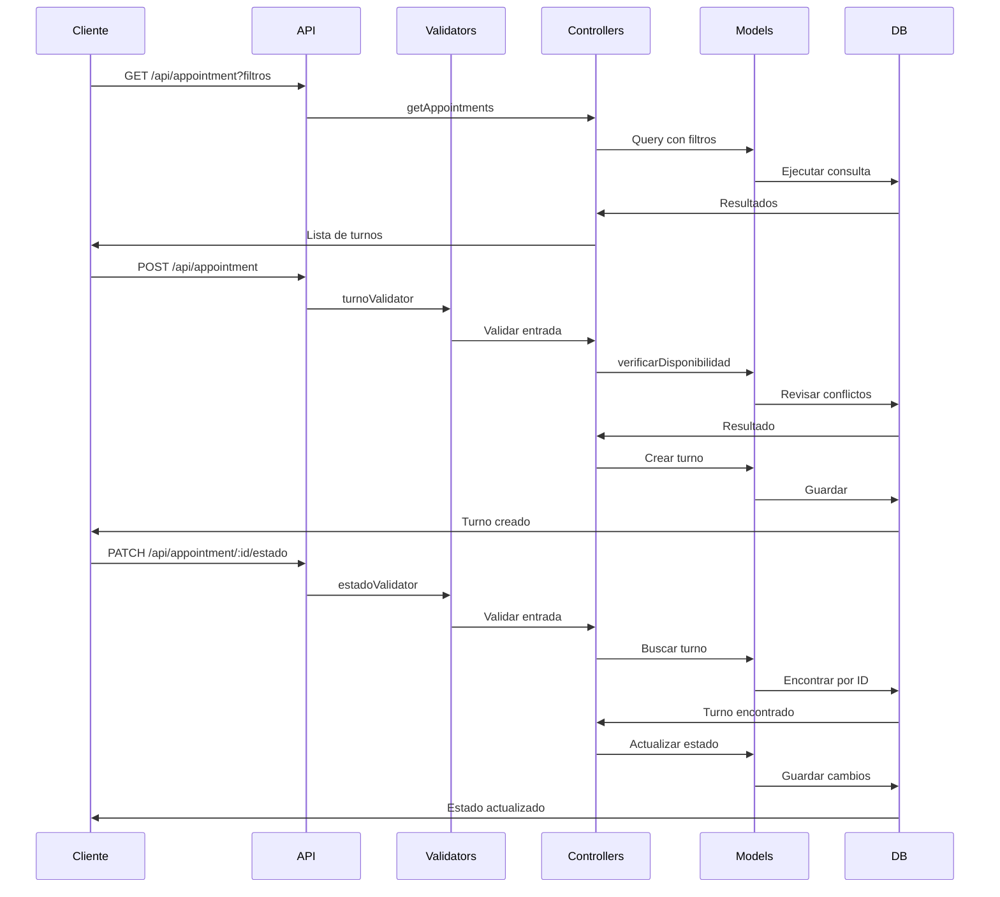

```mermaid
sequenceDiagram
    participant Cliente
    participant API
    participant Validators
    participant Controllers
    participant Models
    participant DB

    Cliente->>API: GET /api/appointment?filtros
    API->>Controllers: getAppointments
    Controllers->>Models: Query con filtros
    Models->>DB: Ejecutar consulta
    DB->>Controllers: Resultados
    Controllers->>Cliente: Lista de turnos

    Cliente->>API: POST /api/appointment
    API->>Validators: turnoValidator
    Validators->>Controllers: Validar entrada
    Controllers->>Models: verificarDisponibilidad
    Models->>DB: Revisar conflictos
    DB->>Controllers: Resultado
    Controllers->>Models: Crear turno
    Models->>DB: Guardar
    DB->>Cliente: Turno creado

    Cliente->>API: PATCH /api/appointment/:id/estado
    API->>Validators: estadoValidator
    Validators->>Controllers: Validar entrada
    Controllers->>Models: Buscar turno
    Models->>DB: Encontrar por ID
    DB->>Controllers: Turno encontrado
    Controllers->>Models: Actualizar estado
    Models->>DB: Guardar cambios
    DB->>Cliente: Estado actualizado
```
