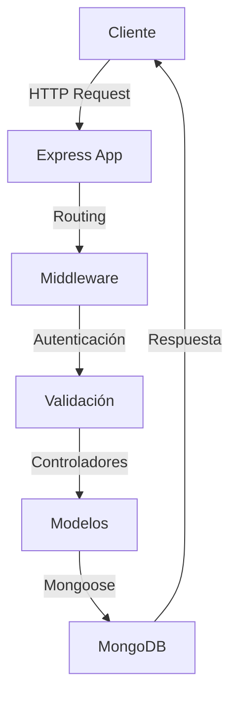

```mermaid
graph TD
    A[Cliente] -->|HTTP Request| B[Express App]
    B -->|Routing| C[Middleware]
    C -->|Autenticación| D[Validación]
    D -->|Controladores| E[Modelos]
    E -->|Mongoose| F[MongoDB]
    F -->|Respuesta| A
```

