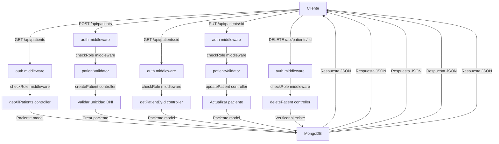

```mermaid
graph TD
    A[Cliente] -->|GET /api/patients| B[auth middleware]
    B -->|checkRole middleware| C[getAllPatients controller]
    C -->|Paciente model| D[MongoDB]
    D -->|Respuesta JSON| A

    A -->|POST /api/patients| E[auth middleware]
    E -->|checkRole middleware| F[patientValidator]
    F -->|createPatient controller| G[Validar unicidad DNI]
    G -->|Crear paciente| D
    D -->|Respuesta JSON| A

    A -->|GET /api/patients/:id| H[auth middleware]
    H -->|checkRole middleware| I[getPatientById controller]
    I -->|Paciente model| D
    D -->|Respuesta JSON| A

    A -->|PUT /api/patients/:id| J[auth middleware]
    J -->|checkRole middleware| K[patientValidator]
    K -->|updatePatient controller| L[Actualizar paciente]
    L -->|Paciente model| D
    D -->|Respuesta JSON| A

    A -->|DELETE /api/patients/:id| M[auth middleware]
    M -->|checkRole middleware| N[deletePatient controller]
    N -->|Verificar si existe| D
    D -->|Respuesta JSON| A
```
