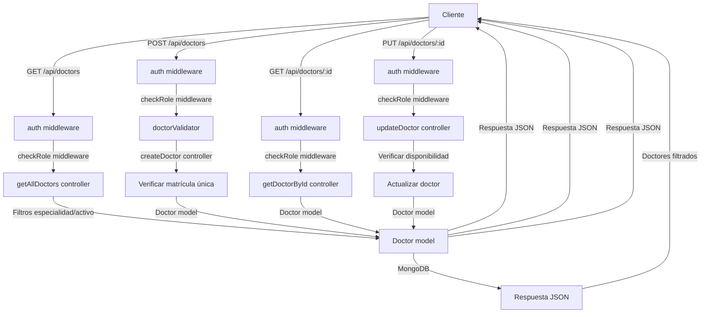

```mermaid
graph TD
    A[Cliente] -->|GET /api/doctors| B[auth middleware]
    B -->|checkRole middleware| C[getAllDoctors controller]
    C -->|Filtros especialidad/activo| D[Doctor model]
    D -->|MongoDB| E[Respuesta JSON]
    E -->|Doctores filtrados| A

    A -->|POST /api/doctors| F[auth middleware]
    F -->|checkRole middleware| G[doctorValidator]
    G -->|createDoctor controller| H[Verificar matrícula única]
    H -->|Doctor model| D
    D -->|Respuesta JSON| A

    A -->|GET /api/doctors/:id| I[auth middleware]
    I -->|checkRole middleware| J[getDoctorById controller]
    J -->|Doctor model| D
    D -->|Respuesta JSON| A

    A -->|PUT /api/doctors/:id| K[auth middleware]
    K -->|checkRole middleware| L[updateDoctor controller]
    L -->|Verificar disponibilidad| M[Actualizar doctor]
    M -->|Doctor model| D
    D -->|Respuesta JSON| A
```
