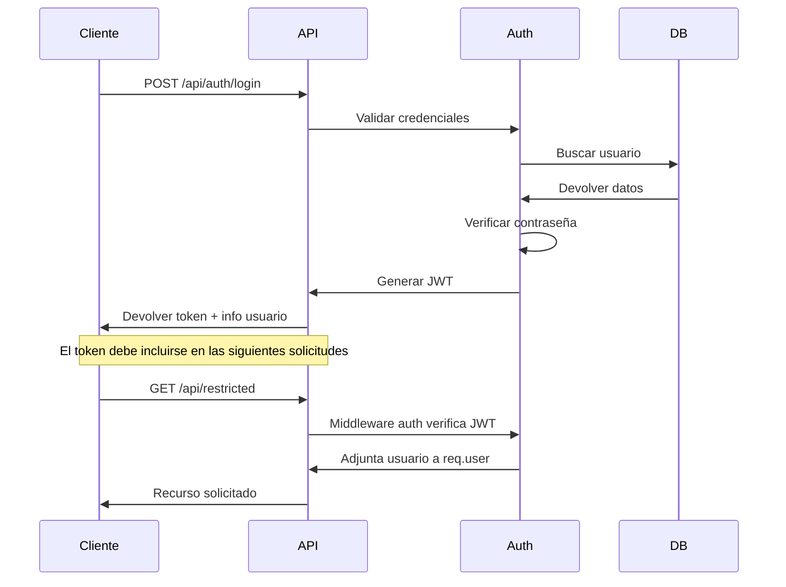

```mermaid
sequenceDiagram
    participant Cliente
    participant API
    participant Auth
    participant DB

    Cliente->>API: POST /api/auth/login
    API->>Auth: Validar credenciales
    Auth->>DB: Buscar usuario
    DB->>Auth: Devolver datos
    Auth->>Auth: Verificar contraseña
    Auth->>API: Generar JWT
    API->>Cliente: Devolver token + info usuario

    Note over Cliente,API: El token debe incluirse en las siguientes solicitudes

    Cliente->>API: GET /api/restricted
    API->>Auth: Middleware auth verifica JWT
    Auth->>API: Adjunta usuario a req.user
    API->>Cliente: Recurso solicitado
```
